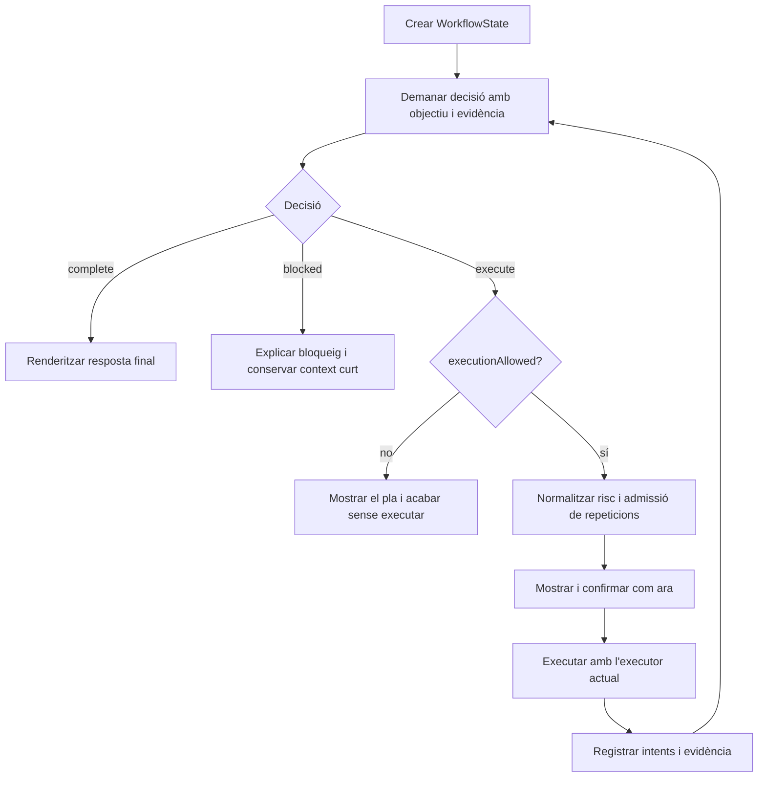

# Disseny d’orquestració de workflow orientada a objectius

**Data:** 2026-08-06

**Estat:** implementat i verificat

**Nivell:** CRITICAL

**Àmbit:** processament intern d’una petició, replanificació, repeticions i mode `/plan`

## 1. Resum

Shellia passarà d’un bucle governat per indicacions prèvies del model a un workflow explícit orientat a l’objectiu. Cada decisió interna tindrà un dels tres resultats canònics:

- `execute`: cal executar un pla visible per avançar;
- `complete`: l’objectiu ja està resolt i es pot donar la resposta final;
- `blocked`: no es pot avançar sense informació, autoritat o recursos que Shellia no té.

No hi haurà un classificador separat de tasques simples i complexes. Una pregunta directa acabarà en una decisió `complete` o en una única execució; una tasca complexa recorrerà el mateix bucle tantes vegades com calgui dins dels límits existents.

El canvi és intern. Es reutilitzen l’executor, la classificació local de risc, les confirmacions, la presentació dels comandos, la memòria curta de sessió i la infraestructura de traces. El resultat final tindrà un únic motor d’orquestració: no es conservarà el flux antic com a compatibilitat interna.

## 2. Problema que resol

El flux actual pateix quatre problemes relacionats:

1. La continuació després d’una execució depèn d’una predicció feta abans de veure’n el resultat. Una execució correcta pot tancar el torn encara que l’objectiu no estigui acabat.
2. Un comando que ja ha funcionat queda vetat per identitat textual, encara que repetir-lo sigui necessari per verificar, consultar un estat nou o complir una petició explícita de l’usuari.
3. El workflow viu implícitament dins de condicionals del bucle principal i de fragments de prompt duplicats. Això dificulta conservar el context causal entre descoberta, acció, resultat i següent decisió.
4. `/plan` comparteix el camí d’execució i pot arribar a executar un pla acceptat, malgrat que semànticament ha de limitar-se a planificar.

La conseqüència visible és un agent que pot aturar-se aviat, insistir en una negativa antiga o perdre el fil del que estava intentant aconseguir.

## 3. Resultat de producte

Després del canvi:

- “Quant espai queda al disc?” es resol amb el mínim necessari i acaba.
- “Reinicia X” mostra què farà, conserva les confirmacions actuals i acaba quan hi ha evidència suficient del resultat.
- Una tasca de descoberta, modificació i verificació continua automàticament entre passos fins que queda completada o bloquejada.
- Repetir un comando és possible quan hi ha una causa explícita; repetir-lo sense progrés provoca reparació o un bloqueig explicat, no una negativa rígida.
- `/plan` retorna un pla i no pot arribar a l’executor.

## 4. Invariants no negociables

### 4.1 Seguretat i autoritat

- La classificació local de seguretat continua sent l’autoritat final.
- El model no pot reduir el nivell de risc ni eliminar una confirmació.
- Es mantenen les confirmacions actuals de plans i comandos perillosos.
- `yes_safe` conserva exactament el seu significat actual.
- Una justificació de repetició només afecta l’admissió del comando; mai la seva seguretat.
- Editar un comando no evita la reclassificació ni la comprovació final de l’executor.

### 4.2 Visibilitat

- Abans d’executar, l’usuari continua veient el comando i el seu propòsit.
- Es reutilitzen els components actuals de presentació, confirmació i resultat.
- La resposta final manté el renderer i l’estil actuals.
- Es poden enriquir els textos de planificació, però no es redissenya la interfície en aquesta feature.

### 4.3 Abast d’execució

- El mode normal pot planificar i executar.
- `/plan` i qualsevol entrada equivalent a plan-only tenen `executionAllowed=false` des de l’inici del torn.
- Amb `executionAllowed=false`, cap decisió pot invocar l’executor, encara que el model retorni comandos o l’usuari accepti el pla.

## 5. Fora d’abast

- Canviar de model, proveïdor o API de model.
- Afegir execució paral·lela de comandos.
- Crear un graf persistent de subtasques o reprendre workflows després de tancar el procés.
- Redissenyar la política de seguretat o les confirmacions.
- Crear un segon runtime, una capa de compatibilitat o flags per alternar entre l’orquestració antiga i la nova.
- Fer un redisseny visual de la CLI.
- Introduir dependències noves si les primitives actuals de Go són suficients.

## 6. Arquitectura proposada

### 6.1 Propietari del workflow

`internal/app` continua sent el propietari de l’orquestració, però el torn deixa de ser una successió implícita de condicionals. Un estat de workflow en memòria concentra l’objectiu, l’autoritat, els intents i el resultat terminal.

Responsabilitats:

- `internal/app`: estat, transicions, límits, admissió de repeticions i terminació;
- `internal/llm`: contracte de decisió, construcció d’un únic prompt coherent i validació estructural de la resposta;
- `internal/executor`: execució seqüencial, dependències, classificació final, confirmacions, timeouts i resultats;
- `internal/safety`: classificació de risc sense canvis de política;
- `internal/session`: projecció compacta del resultat del torn per a follow-ups;
- `internal/ui`: presentació dels plans, comandos, resultats i resposta final;
- `internal/trace`: evidència diagnòstica de decisions, intents i terminació.

Els tipus compartits només es mouran a `internal/core` quan tinguin més d’un consumidor real. L’estat complet del workflow no es converteix en una abstracció global.

### 6.2 Estat canònic del torn

El controlador mantindrà conceptualment:

```text
WorkflowState
  objective
  executionAllowed
  round / planningBudget
  evidenceRevision
  attempts[]
  lastDecision
  stallCount
  outcome
  blocker
```

- `objective`: instrucció resolta del torn, estable durant el workflow;
- `executionAllowed`: autoritat immutable derivada del mode d’entrada;
- `round / planningBudget`: límit finit de decisions i continuacions;
- `evidenceRevision`: augmenta quan una execució o entrada aporta informació nova;
- `attempts`: registre causal i acotat dels plans executats o rebutjats;
- `lastDecision`: decisió estructurada més recent;
- `stallCount`: intents consecutius que no afegeixen evidència ni una acció admissible;
- `outcome`: estat actiu o resultat terminal;
- `blocker`: causa estructurada quan no hi ha finalització correcta.

Aquest estat existeix només durant el torn. La sessió en conserva una projecció curta, no una còpia completa.

## 7. Contracte de decisió

La resposta de planificació tindrà una acció explícita en lloc de camps booleans que competeixen entre si.

### 7.1 `execute`

Requisits:

- inclou almenys un comando;
- cada comando té propòsit i metadades de risc com avui;
- pot incloure una justificació de repetició tipada;
- només és executable quan `executionAllowed=true`.

### 7.2 `complete`

Requisits:

- no inclou comandos;
- inclou la resposta final per a l’usuari;
- indica breument la base de finalització: coneixement directe, evidència observada o resultat d’execució.

La resposta final es renderitza amb la UI existent. Aquesta decisió substitueix la bifurcació entre “planificar” i un resumidor separat que desconeix l’estat complet del workflow.

### 7.3 `blocked`

Requisits:

- no inclou comandos;
- inclou un motiu accionable;
- classifica el bloqueig, com a mínim, en `missing_input`, `unavailable` o `unsafe_to_continue`.

El runtime pot generar altres terminacions deterministes —`cancelled`, `declined`, `planning_limit`, `timeout`, `structural_error` o `no_progress`— sense delegar-ne la decisió al model.

### 7.4 Validació

Una resposta incoherent es rebutja abans d’executar:

- `execute` sense comandos;
- `complete` o `blocked` amb comandos;
- resposta final buida en `complete`;
- bloqueig sense motiu;
- valors de decisió desconeguts.

Una única reparació estructural pot tornar-se a demanar amb l’error concret. Si torna a ser invàlida, el torn acaba amb `structural_error` i conserva l’evidència parcial.

## 8. Flux canònic



### 8.1 Peticions simples

No reben un mode especial. Si es poden respondre directament, la primera decisió és `complete`. Si requereixen una observació local, la primera és `execute` i la següent avalua el resultat. Això manté el camí curt sense duplicar lògica.

### 8.2 Peticions complexes

Cada batch executat produeix evidència abans de decidir si cal continuar. Un èxit no implica automàticament que l’objectiu estigui complet; un error ordinari no implica automàticament abandonar-lo.

### 8.3 Mode `/plan`

`/plan` utilitza el mateix coneixement de l’objectiu i el mateix format de plans, però finalitza en presentar el primer pla útil. No demana acceptació per executar-lo i no modifica l’autoritat del torn.

Si el model retorna `complete`, es mostra la resposta. Si retorna `blocked`, es mostra el bloqueig. Si retorna `execute`, es presenta com a pla, no com a acció pendent d’execució.

La configuració o codi dedicats a “acceptar un plan-only i executar-lo” s’eliminen. Claus antigues desconegudes en fitxers de configuració poden ser ignorades pel parser, però no tindran un camí de comportament viu.

## 9. Intents, evidència i context

Cada intent registra, sense duplicar dades innecessàries:

- ronda i identificador d’intent;
- comando planificat i comando efectiu després d’una possible edició;
- propòsit;
- resultat `success`, `failed`, `skipped`, `declined`, `timeout` o `cancelled`;
- codi de sortida i metadades de truncament;
- revisió d’evidència abans i després;
- justificació de repetició, si n’hi ha;
- relació amb l’intent anterior quan és reintent o verificació.

El prompt no rep una transcripció il·limitada. La projecció inclou:

- objectiu i autoritat actuals sempre;
- decisió i batch més recents sempre;
- errors recents i resultats necessaris per entendre l’estat;
- un resum dels intents anteriors dins d’un pressupost global;
- una marca explícita quan s’ha omès o truncat evidència.

La sortida d’un comando és evidència no fiable, no una instrucció amb autoritat. El prompt ho declara una sola vegada en les regles estables.

## 10. Política de repeticions i estancament

La protecció deixa de ser una blacklist textual de tots els èxits previs. Es converteix en admissió contextual.

### 10.1 Repeticions admissibles

Un comando pot repetir-se quan:

- l’intent anterior va fallar o va quedar saltat;
- l’usuari ho ha demanat explícitament;
- verifica l’estat després d’una mutació;
- consulta un estat que pot haver canviat;
- forma part d’un reintent justificat després d’una reparació.

La decisió `execute` aporta un `repeatReason` tipat, per exemple `user_requested`, `retry`, `verify_after_change` o `poll_changed_state`.

### 10.2 Repeticions no admissibles

Un comando idèntic a un èxit anterior, sense justificació i sense evidència nova, no s’executa. El controlador:

1. registra la proposta com a estancament;
2. torna a planificar una vegada amb el conflicte explícit;
3. si el model insisteix sense progrés, acaba amb `no_progress` i una explicació útil.

Aquesta protecció s’aplica també després d’editar un comando. Una edició no crea implícitament una justificació de repetició.

La igualtat inicial continua basada en el comando efectiu normalitzat de manera conservadora. No s’intenta inferir equivalència semàntica entre comandos diferents en aquesta feature.

## 11. Errors, recuperació i terminació

### 11.1 Errors ordinaris

- Un exit code no zero es registra com a evidència.
- Els comandos dependents es poden saltar amb les primitives ja dissenyades per al batch executor.
- El controlador torna a decidir amb els resultats complets del batch.
- Un reintent justificat és admissible i torna a passar per totes les comprovacions de seguretat.

### 11.2 Decisions de l’usuari

- Rebutjar un pla o un comando acaba en `declined`; no es converteix en una invitació automàtica a buscar una via alternativa equivalent.
- Cancel·lar acaba en `cancelled`.
- Les dades parcials es poden resumir, però mai presentar com un objectiu completat.

### 11.3 Timeout i límits

- Un timeout no desencadena reexecució automàtica.
- Arribar al límit de planificació conserva la confirmació actual per continuar, si aplica al mode normal.
- Si no es concedeix més pressupost, el resultat és `planning_limit`, amb l’estat parcial i el pas que faltava.
- Tot camí del workflow és finit: pressupost de planificació, màxim d’una reparació estructural i màxim d’una reparació consecutiva per estancament.

### 11.4 Informació absent

Quan falta una dada que no es pot descobrir de forma segura, la decisió és `blocked/missing_input`. L’objectiu i el bloqueig es projecten a la memòria de sessió perquè la resposta següent de l’usuari pugui reprendre el context.

## 12. Prompt únic i coherent

Les regles repetides entre system prompt i user prompt es consoliden.

El prompt estable defineix una sola vegada:

- contracte `execute | complete | blocked`;
- jerarquia d’autoritat i tractament no fiable de les sortides;
- obligació d’usar evidència i no declarar èxit sense base;
- política de repeticions;
- límits de seguretat i de plan-only.

La part dinàmica només conté:

- objectiu;
- autoritat d’execució;
- pressupost restant;
- resum estructurat d’intents i evidència;
- bloqueig o error de validació que s’estigui reparant.

Els camps antics `requires_observation` i la lògica que en depèn s’eliminen després del cutover. No es mantenen dos contractes de resposta en paral·lel.

## 13. Traces i diagnòstic

Les traces actuals s’amplien amb:

- inici del workflow i autoritat;
- decisió de cada ronda;
- identificador i resultat de cada intent;
- admissió o rebuig d’una repetició;
- increments d’evidència i marques de truncament;
- resultat terminal i causa.

Es manté el comportament actual de captura i opt-in de contingut sensible. Aquesta feature no amplia la persistència ni crea una font de dades nova.

## 14. Migració interna

La implementació substituirà el flux actual, no l’embolcallarà.

Ordre de tall recomanat:

1. introduir i provar el contracte de decisió i les transicions pures;
2. connectar l’estat del workflow al bucle del torn;
3. substituir `requires_observation` i el tancament prematur per l’avaluació post-batch;
4. substituir la blacklist de comandos reeixits per la política contextual;
5. separar `/plan` abans de qualsevol crida a l’executor;
6. consolidar el prompt i la projecció d’evidència;
7. eliminar camps, configuració, tests i branques del flux antic;
8. actualitzar documentació d’usuari només on `/plan` o la continuació canviïn de significat observable.

No hi haurà flag de compatibilitat. Durant el desenvolupament els passos poden existir en commits separats, però la versió integrada tindrà un únic camí canònic.

## 15. Criteris d’acceptació

### 15.1 Comportament funcional

- Una resposta de coneixement directe acaba sense executor.
- Una consulta local simple executa el mínim necessari i produeix resposta final basada en el resultat.
- Una tasca descoberta → acció → verificació conserva l’objectiu entre rondes i no acaba després del primer èxit.
- Un error ordinari pot provocar un pla reparador i un reintent.
- Un comando correcte pot repetir-se després d’una mutació amb `verify_after_change`.
- Una repetició explícita demanada per l’usuari és admissible.
- Una repetició reeixida sense justificació no s’executa i acaba en reparació o `no_progress`.
- Un batch amb sortida truncada ho declara al model i a les traces.
- Faltar informació acaba en `blocked/missing_input` i el follow-up conserva el context.
- Timeout, cancel·lació, rebuig i límit no es presenten com a èxit.
- `/plan` produeix zero invocacions de runner/executor en totes les variants de resposta del model.

### 15.2 Seguretat

- El risc calculat localment mai disminueix per dades del model.
- Una repetició justificada d’un comando perillós demana la mateixa confirmació que la primera execució.
- Un comando editat es torna a classificar.
- `executionAllowed=false` és immutable durant el torn.
- Cap error de parseig o reparació pot obrir un camí d’execució alternatiu.

### 15.3 Compatibilitat visual

- Els comandos i propòsits continuen visibles abans de l’execució.
- Les confirmacions conserven el text i moment actuals, excepte que `/plan` ja no pregunta si s’ha d’executar.
- La sortida de comandos i la resposta final utilitzen els renderers actuals.
- No s’introdueix un selector manual de tasca simple/complexa.

## 16. Estratègia de verificació

Les proves han d’usar `runtimeDeps`, fake LLMs i runners deterministes.

Proves mínimes:

- taula de transicions vàlides i invàlides del contracte;
- workflows simples, complexos i bloquejats;
- continuació després d’èxit i després d’error;
- límit de rondes i reparacions;
- totes les causes de repetició i el cas d’estancament;
- edició de comandos i reclassificació;
- confirmacions de risc sense regressions;
- `/plan` amb un runner que faci fallar la prova si és invocat;
- projecció acotada d’evidència i marca de truncament;
- memòria de follow-up després de `missing_input`;
- traces amb decisió, intent i terminació.

Verificació de tancament:

```text
gofmt -w ./cmd ./internal
env GOCACHE=/tmp/go-build go test -count=1 ./...
go build -o shellia ./cmd/shellia
```

Abans d’integrar cal una revisió independent centrada en autoritat d’execució, bypass de confirmacions, repeticions perilloses i terminacions falsament exitoses.

## 17. Stop Gates

La feature no es pot considerar acabada si es compleix qualsevol d’aquestes condicions:

1. `/plan` conserva algun camí que pugui arribar al runner.
2. El model pot reduir risc, evitar una confirmació o canviar `executionAllowed`.
3. Existeixen alhora el contracte antic de `requires_observation` i el nou com a motors funcionals.
4. Un workflow pot iterar sense pressupost finit o sense causa terminal registrada.
5. Un èxit de comando es confon amb la finalització de l’objectiu.
6. Una repetició contextual desactiva globalment la protecció contra estancaments.
7. La UI deixa d’ensenyar comando i propòsit abans d’executar.
8. Els tests no demostren que timeout, cancel·lació, rebuig i límit són resultats no exitosos.
9. L’evidència enviada al model no té un pressupost global ni senyal de truncament.
10. Queden branques, configuracions o tipus antics mantinguts només per compatibilitat interna.

## 18. Riscos i mitigacions

| Risc | Impacte | Mitigació |
|---|---|---|
| Més rondes en tasques simples | Latència i cost | Mateix contracte per a resposta directa; la decisió terminal substitueix el resum separat. |
| El model abusa de `repeatReason` | Bucle o accions redundants | Causa tipada, evidència revisionada, límit d’estancament i seguretat local intacta. |
| Estat massa gran | Pèrdua de context útil o prompt inflat | Ledger complet només en memòria i projecció acotada amb truncament explícit. |
| Refactor del bucle central | Regressions de cancel·lació o confirmació | Transicions pures, runtimeDeps, tests de matriu i cutover sense dos motors. |
| `/plan` canvia respecte al test actual | Canvi de comportament intencionat | Nou invariant explícit i proves de zero execució. |
| Resposta final dins del contracte estructurat | Canvi en el streaming | Reutilitzar el renderer final; prioritzar coherència del workflow i mesurar la latència abans d’integrar. |

## 19. Dependències i traspàs

La feature necessita diversos talls ordenats perquè toca el contracte del model, l’estat del torn, l’executor i `/plan`, però no necessita una arquitectura de projecte nova.

El següent artefacte recomanat és un pla d’implementació amb slices verticals i checkpoints de seguretat. Cada slice ha de deixar un únic camí viu i eliminar la part antiga que substitueix.
